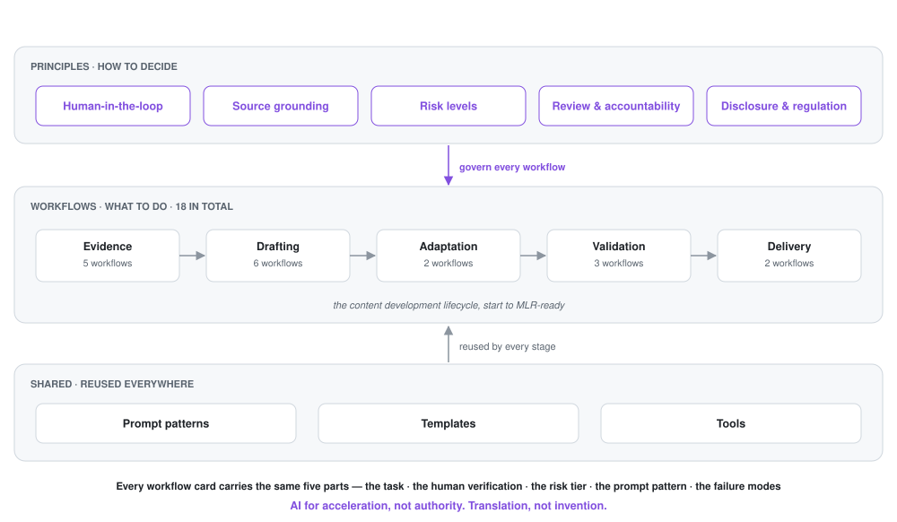
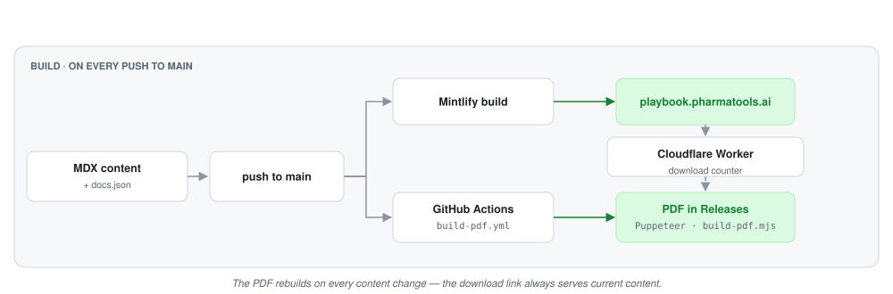

<div align="center">

<picture>
  <source media="(prefers-color-scheme: dark)" srcset="logo-dark.svg">
  
</picture>

<h1>Medical Writing AI Playbook</h1>

<p><strong>You're expected to use AI. You're still accountable for every claim.</strong></p>

<p>An open, workflow-based framework for using AI in medical writing, med comms<br>and pharmaceutical content — without losing scientific accuracy or regulatory control.</p>

<p>
  <a href="https://playbook.pharmatools.ai"></a>
  <a href="https://github.com/nickjlamb/medical-writing-ai-playbook/releases"></a>
  <a href="https://github.com/nickjlamb/medical-writing-ai-playbook/actions/workflows/build-pdf.yml"></a>
  <a href="https://github.com/nickjlamb/medical-writing-ai-playbook/releases/download/latest/Medical-Writing-AI-Playbook.pdf"></a>
  <a href="LICENSE"></a>
  <a href="LICENSE-CODE"></a>
  
</p>

<p>
  <a href="https://playbook.pharmatools.ai/start"><strong>Start here</strong></a> ·
  <a href="#workflow-index">Workflows</a> ·
  <a href="#principles">Principles</a> ·
  <a href="https://playbook.pharmatools.ai/changelog">Changelog</a> ·
  <a href="CONTRIBUTING.md">Contributing</a>
</p>

</div>

---

## What this is

**18 documented workflows** covering the content development lifecycle medical writers actually run — from finding evidence through to MLR-ready deliverables. Each one states what AI can do, what a human must verify, the risk tier, and how long it saves.

It is not a prompt library and not a pitch for automation. Two rules hold the whole thing together:

> **AI for acceleration, not authority.**
> **Translation, not invention.**

The standard of the deliverable does not change because AI was involved. The production process changes. The accountability does not.

---

## Quick start

**Reading it — 60 seconds.** Pick the one that matches your job:

| You are | Start with | Then |
|---|---|---|
| A **freelance medical writer** | [Understanding AI risk](https://playbook.pharmatools.ai/principles/risk-levels) — which of your deliverables sit in which tier | [Summarise a source paper](https://playbook.pharmatools.ai/workflows/summarise-source-paper) — mirrors work you already do |
| An **agency or team lead** | [Start here](https://playbook.pharmatools.ai/start) — the recommended reading order | [Templates](https://playbook.pharmatools.ai/templates/ai-audit-trail-log) — standardise how your team documents AI use |
| A **pharma or MLR reviewer** | [Review and accountability](https://playbook.pharmatools.ai/principles/review-and-accountability) | [MLR-with-AI review checklist](https://playbook.pharmatools.ai/templates/mlr-ai-review-checklist) |
| In a hurry | [Which tool when](https://playbook.pharmatools.ai/tools/decision-tree) — task-to-tool decision tree | [Download the PDF](https://github.com/nickjlamb/medical-writing-ai-playbook/releases/download/latest/Medical-Writing-AI-Playbook.pdf) |

**Running it locally — 30 seconds.** No install needed:

```bash
git clone https://github.com/nickjlamb/medical-writing-ai-playbook.git
cd medical-writing-ai-playbook
npx mint dev          # live preview at http://localhost:3000
```

**Rebuilding the PDF:**

```bash
npm ci
npm run build:pdf     # writes Medical-Writing-AI-Playbook.pdf
```

---

## Architecture

Principles decide, workflows execute, and a shared layer of prompts, templates and tools is reused across both.

<picture>
  <source media="(prefers-color-scheme: dark)" srcset="assets/architecture-dark.svg">
  
</picture>

Every workflow card carries the same five parts, which is what makes them auditable rather than anecdotal:

1. **The task** AI can handle, and the boundary of that contribution
2. **The verification steps** a human must complete
3. **The risk tier**, and what sign-off that implies
4. **The prompt pattern**, source-grounded and reusable
5. **The failure modes** specific to that task

### How it builds and ships

<picture>
  <source media="(prefers-color-scheme: dark)" srcset="assets/build-dark.svg">
  
</picture>

The PDF rebuilds automatically on every content change, so the download link always serves current content.

---

## Examples

**A prompt pattern.** Every pattern constrains the model to the source and marks what needs checking — this one from [Source Analysis Prompts](https://playbook.pharmatools.ai/prompts/source-analysis-prompts):

```text
You are a medical writing assistant. Summarise the following published paper
into a structured format.

Sections:
- Citation
- Study design and objective
- Population (key criteria, sample size)
- Primary endpoint and results
- Key secondary endpoints and results
- Safety findings
- Authors' conclusions
- Limitations

Rules:
- Use only information from the provided paper
- Reproduce all data points exactly as stated
- Label subgroup or post-hoc results explicitly
- Do not interpret beyond the authors' stated conclusions
- Flag uncertain data points with [VERIFY]

Paper:
[INSERT FULL TEXT]
```

**A disclosure line.** Specific enough to survive an audit, from the [disclosure templates](https://playbook.pharmatools.ai/templates/disclosure-language):

> Claude (Anthropic, Opus 4.7) was used between 3 and 11 June 2026 to draft the Discussion section. Output was reviewed and edited by [Author X], who takes responsibility for the accuracy and integrity of the final content.

**A boundary.** From [Declaring AI Use](https://playbook.pharmatools.ai/principles/declaring-ai-use) — disclosure and permission are different tests:

> JAMA Network now prohibits AI-generated references, AI-drafted Opinion pieces and Letters, and AI-created clinical imagery outright. Declaring them does not make them submittable.

---

## Workflow index

Risk tiers set the review requirement. Time estimates are per deliverable, from the workflow pages.

| # | Workflow | Stage | Risk | Time saved |
|---|---|---|---|---|
| 1 | [Find evidence](https://playbook.pharmatools.ai/workflows/find-evidence) | Evidence | Low | ~15 min vs ~2–3 hrs |
| 2 | [Summarise a source paper](https://playbook.pharmatools.ai/workflows/summarise-source-paper) | Evidence | Low | ~10 min vs ~45 min |
| 3 | [Prepare a congress or poster summary](https://playbook.pharmatools.ai/workflows/prepare-congress-or-poster-summary) | Evidence | Low–Medium | ~10 min vs ~30 min |
| 4 | [Extract study data](https://playbook.pharmatools.ai/workflows/extract-study-data) | Evidence | Medium | ~15 min vs ~45 min |
| 5 | [Extract key messages](https://playbook.pharmatools.ai/workflows/extract-key-messages) | Evidence | Medium | ~15 min vs ~60 min |
| 6 | [Build a content outline](https://playbook.pharmatools.ai/workflows/build-content-outline) | Drafting | Low | ~10 min vs ~30 min |
| 7 | [Write a manuscript](https://playbook.pharmatools.ai/workflows/write-a-manuscript) | Drafting | Medium–High | ~30 min vs ~2–3 hrs per section |
| 8 | [Draft a regulatory document](https://playbook.pharmatools.ai/workflows/draft-regulatory-document) | Drafting | High | ~30 min vs ~2–3 hrs per section |
| 9 | [Convert statistical outputs to narrative](https://playbook.pharmatools.ai/workflows/convert-stats-to-narrative) | Drafting | High | ~10 min vs ~30 min per table |
| 10 | [Create a medical slide deck](https://playbook.pharmatools.ai/workflows/create-medical-slide-deck) | Drafting | Medium | ~20 min vs ~90 min |
| 11 | [Generate concept visuals](https://playbook.pharmatools.ai/workflows/generate-concept-visuals) | Drafting | Medium | ~5–15 min per visual |
| 12 | [Adapt for different audiences](https://playbook.pharmatools.ai/workflows/adapt-for-different-audiences) | Adaptation | Low–Medium | ~15 min vs ~60 min |
| 13 | [Create a plain language summary](https://playbook.pharmatools.ai/workflows/create-plain-language-summary) | Adaptation | Medium–High | ~20 min vs ~90 min |
| 14 | [Verify claims against references](https://playbook.pharmatools.ai/workflows/verify-claims-against-references) | Validation | High | ~20 min vs ~2–3 hrs |
| 15 | [Check promotional compliance](https://playbook.pharmatools.ai/workflows/check-promotional-compliance) | Validation | High | ~15 min vs ~60 min |
| 16 | [Check document consistency](https://playbook.pharmatools.ai/workflows/check-document-consistency) | Validation | High | ~15 min vs ~60 min |
| 17 | [Repurpose content across channels](https://playbook.pharmatools.ai/workflows/repurpose-content-across-channels) | Delivery | Medium | ~15 min vs ~45 min per channel |
| 18 | [Final human review](https://playbook.pharmatools.ai/workflows/final-human-review) | Delivery | Critical | ~30 min vs ~45 min |

---

## Principles

Twelve pages covering how to decide, not just what to run.

| | |
|---|---|
| [Human-in-the-Loop Decision Making](https://playbook.pharmatools.ai/principles/human-in-the-loop) | Every deliverable has a named owner who signs off |
| [Source Grounding](https://playbook.pharmatools.ai/principles/source-grounding) | If it is not in the source, it is not in the output |
| [The Description–Discernment Loop](https://playbook.pharmatools.ai/principles/description-discernment) | Briefing AI properly, and judging output for voice as well as accuracy |
| [Understanding AI Risk](https://playbook.pharmatools.ai/principles/risk-levels) | Which deliverables sit in which tier |
| [AI Risk Framework](https://playbook.pharmatools.ai/principles/ai-risk-framework) | The full tiering model and its review requirements |
| [AI Failure Modes](https://playbook.pharmatools.ai/principles/ai-failure-modes) | Ten predictable ways AI fails on scientific evidence |
| [Review and Accountability](https://playbook.pharmatools.ai/principles/review-and-accountability) | Sign-off protocols and audit trails |
| [Declaring AI Use](https://playbook.pharmatools.ai/principles/declaring-ai-use) | Journal, regulator and sponsor disclosure expectations |
| [AI Regulation in Pharma](https://playbook.pharmatools.ai/principles/ai-regulation) | EU AI Act tiers, transparency duties, provider obligations |
| [Choosing Your Model](https://playbook.pharmatools.ai/principles/choosing-your-model) | Reasoning vs standard vs frontier, and what each costs |
| [Agentic Workflows](https://playbook.pharmatools.ai/principles/agentic-workflows) | When a multi-step AI process earns its cost, and when it does not |
| [AI in Peer Review](https://playbook.pharmatools.ai/principles/ai-in-peer-review) | What publishers screen for before a human sees your paper |

---

## Prompts, templates and tools

**[Prompt patterns](https://playbook.pharmatools.ai/prompts/source-analysis-prompts)** — source analysis, outlining, adaptation, review. Each designed for a specific task with defined inputs and source-grounding constraints.

**[Templates](https://playbook.pharmatools.ai/templates/disclosure-language)** — disclosure language, AI audit-trail log, MLR-with-AI review checklist, pre-submission QC checklist. Ready to adapt into your own SOPs.

**[Tools](https://playbook.pharmatools.ai/tools/decision-tree)** — a task-to-tool decision tree, a directory of the wider ecosystem, and pages for the purpose-built tools from [PharmaTools.AI](https://pharmatools.ai):

| Tool | What it does |
|---|---|
| [RefCheckr](https://playbook.pharmatools.ai/tools/refcheckr) | Closed-loop: verifies claims against references, rewrites, re-checks |
| [MedCheckr](https://playbook.pharmatools.ai/tools/medcheckr) | Scans for promotional compliance signals |
| [PubCrawl](https://playbook.pharmatools.ai/tools/pubcrawl) | Literature search and evidence gathering |
| [Patiently AI](https://playbook.pharmatools.ai/tools/patiently-ai) | Translates clinical content into patient-friendly language |
| [LLMentor](https://playbook.pharmatools.ai/tools/llmentor) | Adapts content across audience levels |
| [PLS Generator](https://playbook.pharmatools.ai/tools/pls-generator) | Plain language summaries from clinical sources |
| [PosterLens](https://playbook.pharmatools.ai/tools/posterlens) | Structured data extraction from scientific posters |

---

## Repository structure

```
medical-writing-ai-playbook/
├── index.mdx              Homepage
├── start.mdx              Recommended reading order
├── glossary.mdx           AI terms, defined for medical writers
├── changelog.mdx          Version history
├── docs.json              Site config and navigation
├── principles/            12 pages — how to decide
├── workflows/             18 pages — what to do, step by step
├── prompts/                4 pages — reusable prompt patterns
├── templates/              7 files — disclosure, audit trail, QC checklists
├── tools/                  9 pages — tool pages, ecosystem, decision tree
├── snippets/              Shared MDX components (risk badge, download counter)
├── product/               Positioning, SEO metadata, launch notes
├── scripts/               PDF build (Puppeteer)
├── counter-worker/        Cloudflare Worker — PDF download counter
└── .github/workflows/     CI — rebuilds and publishes the PDF on content change
```

---

## Roadmap

| Status | Item |
|---|---|
| ✅ Shipped | Downloadable PDF, auto-rebuilt on every content change |
| ✅ Shipped | Disclosure, regulation and peer-review principles |
| ✅ Shipped | Tool decision tree and ecosystem directory |
| 🔜 Next | Worked examples — source input → AI draft → human review → final output |
| 🔜 Next | Interactive workflow selector: "What are you writing? Who is it for?" |
| 📋 Planned | Agency SOP integration guide |
| 📋 Planned | Anonymised case studies from real med comms projects |
| 📋 Planned | Expanded regulatory coverage as EU AI Act high-risk obligations land (August 2027) |

---

## What this is not

- **Not a replacement for a medical writer.** Every workflow produces draft material requiring trained review. AI moves the starting line forward — it does not move the finish line.
- **Not regulatory or legal guidance.** Compliance workflows pre-screen for common issues. They do not replace MLR review, legal counsel, or regulatory affairs assessment.
- **Not an autonomous content pipeline.** There is no path here where AI output goes straight into a deliverable.
- **Not a generic prompt collection.** Every pattern targets a specific med comms task, with defined inputs and review checkpoints.

---

## Contributing

Corrections, broken links and workflow suggestions are welcome — see [CONTRIBUTING.md](CONTRIBUTING.md). Policy pages date quickly, so if you spot a journal or regulator that has changed its position, [open an issue](https://github.com/nickjlamb/medical-writing-ai-playbook/issues/new/choose).

## Licence

Content is [CC BY 4.0](LICENSE) — use and adapt it, including commercially, with attribution. Build scripts and the Cloudflare Worker are [MIT](LICENSE-CODE).

---

<div align="center">
<sub>A free resource from <a href="https://pharmatools.ai">PharmaTools.AI</a> — practical AI tools for medical writing and pharmaceutical communications.</sub>
</div>
