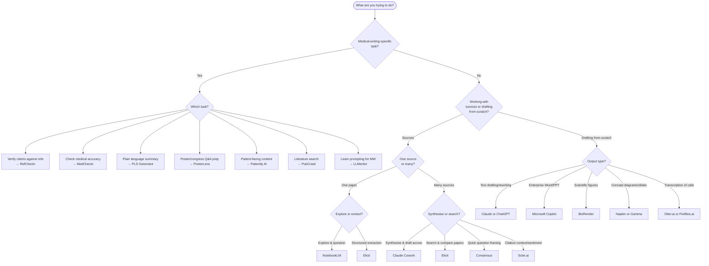

## What this page is

A quick decision aid for picking the right tool for a given medical writing task. It maps common jobs-to-be-done to the tool best suited to them, drawing on both third-party tools and the PharmaTools.AI suite.

Use it as a starting point, not a prescription. Tool choice also depends on your organisation's policies, the sensitivity of the data involved, and your own familiarity with the tool. The writer remains responsible for verifying outputs against the source.

## The decision tree

## Fast reference

If you already know what you need, jump straight to the tool:

**Working with sources**
- One paper, exploring it → [NotebookLM](/tools/ecosystem#notebooklm)
- Many papers, synthesising across them → [Claude Cowork](/tools/ecosystem#claude-cowork)
- Structured extraction from multiple papers → [Elicit](/tools/ecosystem#elicit)
- Framing a research question quickly → [Consensus](/tools/ecosystem#consensus)
- Checking citation context or sentiment → [Scite.ai](/tools/ecosystem#scite-ai)

**Drafting and output**
- General text drafting and rewriting → [Claude or ChatGPT](/tools/ecosystem#claude-chatgpt)
- Enterprise Word/PowerPoint environments → [Microsoft Copilot](/tools/ecosystem#microsoft-copilot)
- Publication-quality scientific figures → [BioRender](/tools/ecosystem#biorender)
- Conceptual diagrams or generated slides → [Napkin / Gamma](/tools/ecosystem)
- Advisory board or KOL transcription → [Otter.ai / Fireflies.ai](/tools/ecosystem)

**Medical-writing-specific tasks**
- Verify claims against references → [RefCheckr](/tools/refcheckr)
- Check medical accuracy → [MedCheckr](/tools/medcheckr)
- Plain language summaries → [PLS Generator](/tools/pls-generator)
- Poster and congress Q&A prep → [PosterLens](/tools/posterlens)
- Patient-facing content → [Patiently AI](/tools/patiently-ai)
- Literature search (MCP-enabled) → [PubCrawl](/tools/pubcrawl)
- Prompt craft for medical writing → [LLMentor](/tools/llmentor)

## A note on overlap

Several tools overlap. Perplexity, Consensus, and Elicit all help with literature exploration; Claude and ChatGPT are largely interchangeable for drafting; Napkin and Gamma both generate visual slides. The tree above recommends one starting point per path — switch to an alternative if your organisation already has a preferred tool or a licence in place.

The more important decision is usually *not* which tool, but whether you are using AI for the right kind of task. See [Risk levels](/principles/risk-levels) and [Human in the loop](/principles/human-in-the-loop) for the principles that should guide that choice.
